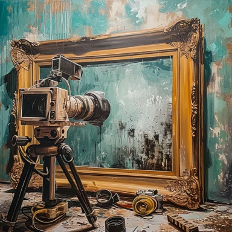

# camera calibration

## state
***
:fire: 

## about
***
the goal of this project is to complete
the camera calibration algorithm in `rust`
for refactoring the original `c++` implementation 
of the camera calibration algorithm.
